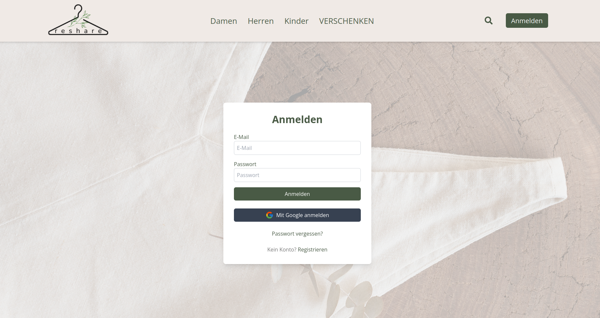

# 🎓 Abschlussprojekt – Webentwicklung

Dies ist das Abschlussprojekt, das wir im Rahmen des **Web Development** Kurses am Digital Career Institute entwickelt haben.
Dabei verbinden wir **Frontend und Backend** mit dem **MERN-Stack** (MongoDB, Express.js, React, Node.js) und setzen **Tailwind CSS** für das Design ein.
Mit diesem Projekt demonstrieren wir, wie wir die erlernten Technologien in einer **Full-Stack-Webanwendung** umgesetzt haben.

<br>

# 👕 reshare – Kleiderplattform

**reshare** – die nachhaltigen Schenkbörse für Kleidung!
Diese Webanwendung verbindet moderne Technologien mit dem Ziel, Kleidung ein zweites Leben zu schenken.

<br>

## 🎯 Projektziele

**Nachhaltigkeit fördern**: Kein Platz mehr im Kleiderschrank? - Verschenke deine Kleidung, anstatt sie wegzuwerfen!

**Benutzerfreundlichkeit**: Einfache und intuitive Bedienung.

**Sicherheit**: Moderne Authentifizierungsmethoden, einschließlich Google-Login und Passwort-Reset.

**Kommunikation**: Direkter Austausch zwischen Nutzern über eine integrierte Chatfunktion.

**Flexibilität**: Responsives Design für optimale Darstellung auf allen Geräten.

<br>

## ⚙️ Haupttechnologien & Tools

**Frontend**: React mit Vite

**Backend**: Node.js mit Express

**Datenbank**: MongoDB Atlas mit Atlas Search

**Styling**: Tailwind CSS mit individuell angepasster Farbpalette

**Authentifizierung**: JWT, Cookies, Google OAuth

**E-Mail-Service**: Nodemailer (für Passwort-Reset und Kontaktformular)

**Echtzeit-Kommunikation**: Socket.IO

**Bild-Uploads**: Cloudinary, Multer

<br>

## 🔧 Funktionen

**Registrierung & Login**

Erstelle ein Konto oder nutze die Anmeldung über Google – schnell, sicher und benutzerfreundlich.

**Passwort-Reset**

Falls du dein Passwort vergessen hast, senden wir dir eine E-Mail mit Anweisungen zum Zurücksetzen.
_(Implementiert von Ines)_

**Produktverwaltung**

Lade Kleidungsstücke mit Beschreibung, Kategorie und Bild hoch, bearbeite oder lösche sie.
_(Implementiert von Natalia)_

**Such- und Filterfunktion**

Finde gezielt Kleidung über die Suchleiste und/oder filtere nach Farbe, Größe, Kategorie und/oder Standort.
_(Entwickelt von Ming)_

**Chatfunktion**

Kommuniziere direkt mit anderen Nutzern, um Übergabedetails oder Versandoptionen zu besprechen.
_(Implementiert von Chrissi und Lara)_

**Kontaktformular**

Du hast noch eine Frage? Deine Nachricht über das Kontaktformular wird direkt an uns gesendet.
_(Implementiert von Chrissi)_

**Responsives Design**

Die Plattform ist für Smartphones, Tablets und Desktops optimiert, sodass du von jedem Gerät aus bequem darauf zugreifen kannst.

<br>

## 🎥 Gifs und Screenshots

Hier einige Eindrücke unserer Plattform:

**Login-Seite**



**Filter- und Suchfunktion**


**Startseite / Landingpagevorschau**


**Responsive / Responsivevorschau**


**Produktupload mit Bildvorschau**


<br>

## ❤️ Unser Team

**Ines**

Verantwortlich für Authentifizierung (Login, Registrierung, Google Login, Passwort-Reset), Datenmodellierung im Backend, ReadME.

**Lara**

Entwickelte die Chatfunktion mit Socket.IO, Datenmodellierung im Backend.

**Natalia**

Zuständig für Produktverwaltung, Datenmodellierung im Backend, Gestaltung der "Über uns"-Seite.

**Ming**

Implementierte die Suchleiste und Filterfunktion, Gestaltung des Headers.

**Chrissi**

Gestaltung von Landingpage und Footer mit Kontaktformular, Unterstützung bei Chatimplementierung.

**Gemeinsame Aufgaben im Team:**

Koordination

Projektmanagement (Kanban)

Frontend-Struktur und Backend-Struktur

Tailwind-Styling, UI-Design

Kommunikation

Präsentation

Testing

ReadMe

Deployment

<br>

## 🔗 GitHub-Profile

- **Ines** – [https://github.com/dci1234ines](https://github.com/dci1234ines)
- **Lara** – [https://github.com/LaraKempf](https://github.com/LaraKempf)
- **Natalia** – [https://github.com/Khlipochenko](https://github.com/Khlipochenko)
- **Ming** – [https://github.com/MingWessels](https://github.com/MingWessels)
- **Chrissi** – [https://github.com/AKE48](https://github.com/AKE48)

<br>

## 🔗 GitHub Repository

Hier findet ihr unser gemeinsames Repository:
[github.com/AKE48/reshare](https://github.com/AKE48/reshare)

<br>

## 🏁 Installation & Nutzung

### Voraussetzungen

**Node.js** (Version 14 oder höher)

**npm** (Node Package Manager)

**MongoDB** (lokal installiert oder Zugriff auf MongoDB Atlas)

### Backend

**Repository klonen:**

```bash
git clone https://github.com/AKE48/reshare.git
```

**In das Backend-Verzeichnis wechseln:**

```bash
cd reshare/backend
```

**Abhängigkeiten installieren:**

```bash
npm install
```

**Umgebungsvariablen konfigurieren:**

    Erstelle eine `.env`-Datei im Backend-Verzeichnis mit folgenden Inhalten:

```env
PORT=your port
MONGO_URI=your_mongodb_connection_string
JWT_SECRET=your_jwt_secret
CLOUDINARY_CLOUD_NAME=your_cloudinary_cloud_name
CLOUDINARY_API_KEY=your_cloudinary_api_key
CLOUDINARY_API_SECRET=your_cloudinary_api_secret
NODE_ENV=dev
GOOGLE_CLIENT_ID=
GOOGLE_CLIENT_SECRET=
EMAIL_USER=
EMAIL_PASS=
EMAIL_SERVICE=gmail
ORIGIN_BACKEND=
ORIGIN=
```

**Server starten:**

```bash
npm run start
```

### Frontend

**In das Frontend-Verzeichnis wechseln:**

```bash
cd ../frontend
```

**Abhängigkeiten installieren:**

```bash
npm install
```

**Umgebungsvariablen konfigurieren:**

    Erstelle eine `.env`-Datei im Frontend-Verzeichnis mit den erforderlichen Umgebungsvariablen.

```env
VITE_API_URL=
```

**Entwicklungsserver starten:**

```bash
npm run dev
```

<br>

## 🙏 Dankeschön

Ein großes Dankeschön an unsere Dozenten für ihre Unterstützung, Geduld und ihr Wissen. Und an unsere Mitstudierenden für den tollen Austausch, Feedback und Teamgeist.

**Dieses Projekt war für uns nicht nur Programmieren – sondern echte Zusammenarbeit.**

**❤️ Euer reshare-Team**
